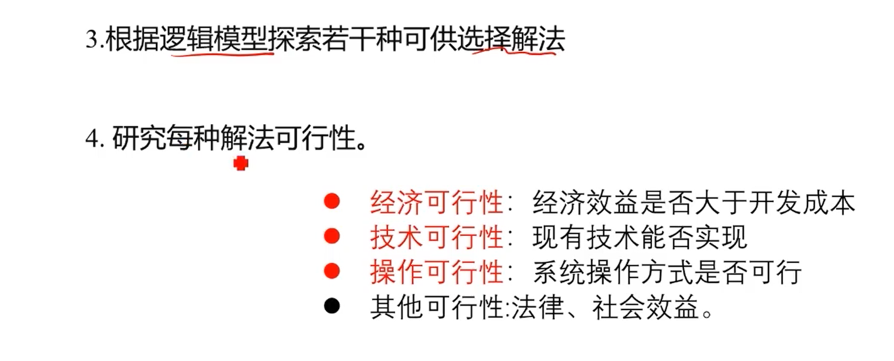

# 软件工程复习

## 1. 环形复杂度、独立路径

## 2. 黑盒、白盒测试

* 什么是黑盒测试：

> 黑盒测试也称为功能测试,它着眼于程序的外部特征,而不考虑程序的内部逻辑结构。测试者把被测程序看成一个黑盒,不用关心程序的内部结构。黑盒测试是在程序接口处进行测试，它只检查程序功能是否能按照规格说明书的规定正常使用，程序是否能适当地接收输入数据产生正确的输出信息，并且保持外部信息(如数据库或文件)的完整性。

* 黑盒测试主要采用的技术有哪些?

> 等价分类法、边界值分析法、错误推测法和因果图等技术。

* 什么是白盒测试

> 白盒测试是测试者了解被测程序的内部结构和处理过程,对程序的所有逻辑路径进行测试,在不同点检查程序状态,确定实际状态与预期状态是否一致。

* 白盒测试主要采用的技术有哪些？

> 路径测试技术和事务处理流程技术，对包含有大量逻辑判断或条件组合的程序采用基于逻辑的测试技术。

## 3. 数据流图

## 4. 软件生命周期

* 定义：软件声明周期由软件定义、软件开发和运行维护 3个时期组成，每个时期又进一步划分成若干个阶段。

1. 软件定义时期
    * 软件定义时期的任务：  
        * 确定软件开发工程必须完成的总目标
        * 确定工程的可行性
        * 导出实现工程目标应该采用的策略及系统必须完成的的功能
        * 估计完成该项目工程需要的资源和成本，并且制定工程进度表。这个时期又称为系统分析，由系统分析员负责完成
    * 软件定义时期通常进一步划分为3个阶段，即**问题定义**、**可行性研究**和**需求分析**。
2. 软件开发时期
    * 开发时期具体设计和实现在前一个时期定义的软件，它通常由下述4个阶段组成：
        * 总体设计
        * 详细设计
        * 编码和单元测试
        * 综合测试
    * 其中前两个阶段又称为**系统设计**，后两个阶段又称为**系统实现**。
3. 维护时期  
    * 维护时期的主要任务是使软件持久地满足用户的需要。  
        * 当软件在使用过程中发现错误时应该加以改正  
        * 当环境改变时应该修改软件以适应新的环境  
        * 当用户有新要求时应该及时改进软件以满足用户的新需要  
    * 通常对维护时期不再进一步划分阶段，但是每一次维护活动本质都是一次压缩和简化了的定义和开发过程。

* 总结
    1. 什么是软件生命周期?
        > 一个软件从定义，开发，使用和维护，直到最终被废弃，要经历一个漫长的时期，通常把软件经历的这个漫长时期称为生命周期
    2. 软件的生命周期有哪几个阶段
        > 三个阶段：定义、开发、维护
        > 八个步骤：问题定义、可行性研究、需求分析；总体设计、详细设计、编码与单元测试、综合测试；运行维护。

## 5. 结构化程序的设计主要思想

* 说明结构化程序设计的主要思想是什么

    > 1. 自顶向下、逐步求精的程序设计方法
    > 2. 使用3种基本控制结构、单入口、单出口来构造程序。

## 6. 软件生命周期各个阶段的任务

* 软件生命周期各个阶段的任务

    > 1. 定义阶段：问题定义–任务：关于规模和目标的报告书；
    > 2. 可行性研究–任务：系统的高层逻辑模型：数据流图，成本/效益分析；
    > 3. 需求分析–任务：系统的逻辑模型：数据流图，数据字典，算法描述。
    > 4. 开发阶段：总体设计–任务：系统流程图，成本/效益分析，推荐的系统结构：层次图/结构图；详细设计–任务：HIPO图或PDL图；
    > 5. 编码和单元测试–任务：源程序清单，单元测试方案和结果；
    > 6. 综合测试–任务：综合测试方案，结果集成测试，验收测试，完整一致的软件配置。
    > 7. 维护阶段：软件维护–任务：维护记录以及改正性维护，适应性维护，完整性维护和预防性维护

## 7. 软件重用的效益

* 软件重用的效益（P266）

> 1. 质量
> 2. 生产率
> 3. 成本

## 8. 需求分析与软件设计二个阶段任务的主要区别

* 答案（本题解答题的可能性极大）

> 需求分析定义软件的用户需求，即定义待开发软件能做什么。
> 软件设计定义软件的实现细节以满足用户需求，即研究如何实现软件。

## 9. 大型软件系统的测试包括那些步骤

* 测试步骤

    > 1. 模块测试：将每一个模块作为一个单独的测试单元，保证每个模块作为一个单元能正确运行。 (编码测试阶段)
    > 2. 子系统测试：将经过单元测试的模块放在一起形成一个子系统来测试，以测试模块间的接口正确性作为主要任务。 (集中测试阶段)
    > 3. 系统测试：将经过测试的子系统装配成一个完整的系统来测试，检验系统是否确实能实现需求规格说明书中的功能，以及系统的动态特征是否符合预定要求。 阶段 系统测试是指整个计算机系统(包括软硬件)的测试,可与系统的安装和验收相结合进行。(集中测试阶段)
    > 4. 验收测试：在用户的参与下，把软件系统作为单一的实体进行测试，使软件系统能满足用户的需要。测试内容与系统测试基本相同。 (验收阶段)
    > 5. 平行运行： 新旧两个系统同时运行进行比较，避免风险的同时给用户对新系统一段熟悉的时间(运行阶段)

## 10. 软件维护的类型有那几种

* 什么叫软件维护
    > 软件维护就是在软件已经交付使用之后，为了改正错误或满足新的需要而修改软件的过程

* 软件维护的种类

    > 1. 改正性维护：为了纠正在使用过程中暴露出来的错误而进行的改正性维护
    > 2. 适应性维护：为了适应外部环境的变化而进行的适应性维护
    > 3. 完善性维护：为了改进原有的软件而进行的完善性维护
    > 4. 预防性维护：为了改进将来的可维护性而进行的预防性维护

## 11. 什么是编码风格?为什么要强调编码风格?

* 什么是好的编码风格

    > 1. 使用标准的控制结构；
    > 2. 有限制地使用GOTO语句；
    > 3. 源程序的文档化 （应具备以下内容）
    >   ①有意义的变量名称 —— “匈牙利命名规则 ”。
    >   ②适当的注释 ——“注释规范”。
    >   ③标准的书写格式：
    >   ——用分层缩进的写法显示嵌套结构的层次（锯齿形风格）；
    >   ——在注释段的周围加上边框；
    >   ——在注释段与程序段、以及不同程序段之间插入空行；
    >   ——每行只写一条语句；
    >   ——书写表达式时，适当使用空格或圆括号等作隔离符。
    > 4. 满足运行工程学的输入输出风格。

* 为什么要强调编码风格

    > 良好的编码风格可以使代码的逻辑简明清晰、易读易懂。

## 12. 单元测试期间，着重对哪个方面进行测试

* 测试重点（P153）

> 1. 模块接口
> 2. 局部数据结构
> 3. 重要的执行通路
> 4. 出错处理通路
> 5. 边界条件

## 13. 什么是耦合 耦合类型

* 耦合和内聚

    > 模块的独立程度可以由两个定性标准度量，这两个标准是耦合和内聚

* 耦合：

    >耦合表示一个软件结构内各个模块之间的互连程度

* 耦合类型：（耦合程度从高到低）

    >1. 内容耦合：一个模块直接访问另一个模块的内容。
    >2. 公共耦合：组模块都访问同一全局数据结构。
    >3. 控制耦合：组模块都访问同一个数据项。
    >4. 数据耦合：一个模块明显地把开关量、名字等信息送入另一模块，控制另一模块的功能

> 

## 14. 软件可维护的因素有哪个几个

* 软件的可维护性：

    > 维护人员理解、改正、改动或改进这个软件的难易程度

* 决定软件可维护性的因素（**P194**）

    > 1. 软件的可理解性、可测试性、可修改性；
    > 2. 文档描述符合要求、用户文档简洁明确、系统文档完整并且标准。

## 15. 什么是内聚?模块的内聚类型

* 内聚：

    > 一个模块内各个元素结合的精密程度

* 模块的内聚类型（由弱到强）

    > 1. 偶然内聚
    > 2. 逻辑内聚
    > 3. 时间内聚
    > 4. 过程内聚
    > 5. 通信内聚
    > 6. 顺序内聚
    > 7. 功能内聚

## 16. 数据字典是有哪几类元素定义组成的

* 数据字典由下列4类元素的定义组成：

    > 1. 数据流  
    > 2. 数据流分量（即数据元素）
    > 3. 数据存储
    > 4. 处理

## 17. 软件工程定义

## 18. 总体设计过程包括那两个阶段

* 总体设计过程主要有两个阶段（P91）

> 1. 系统设计阶段，确定系统的具体实现方案。
> 2. 结构设计阶段，确定软件结构。

## 19. 投资回收期的定义

* 投资回收期的定义（P52）

> 通常用投资回收期衡量一项开发工程的价值。所谓投资回收期就是使累计的经济效益等于最初投资所需要的时间

## 20. 可靠性的定义

* 软件可靠性的定义（**P179**）

> 软件可靠性是程序在给定的时间间隔内，按照规格说明书的规定成功地运行概率

## 21. 瀑布模型的主要特点
  
  

* 定义：  

>将基本的开发活动看成是一系列界限分明的独立阶段，这是一种计划驱动的软件过程，有利于规范软件开发活动。
>以预测性为原则
>以文档驱动开发过程
>以过程控制为核心

* 特点：  
>
>1. 活动间具有顺序性和依赖性；  
>2. 推迟实现观点；  
>3. 质量保证观点；  
>4. 缺少对变化的适应;  
>
* 适用范围：  

>瀑布模型适用于功能、性能明确、完整、无重大变化的软件系统的开发

## 23. 可维护软件的主要特性

## 24. 可行性研究三个方面

